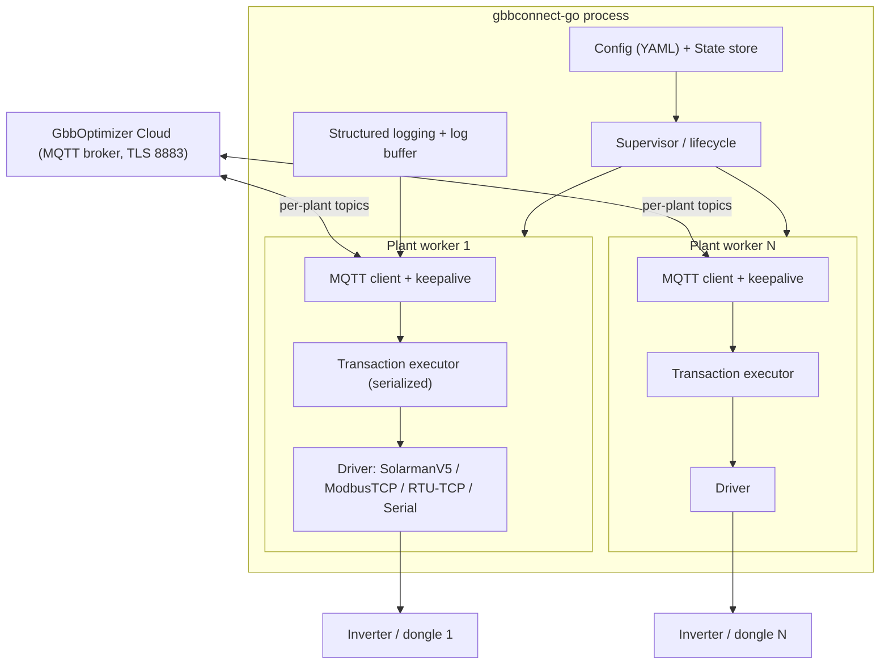
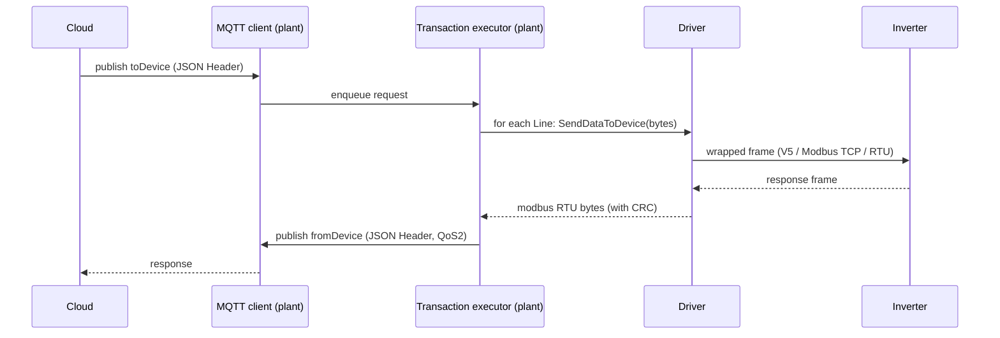
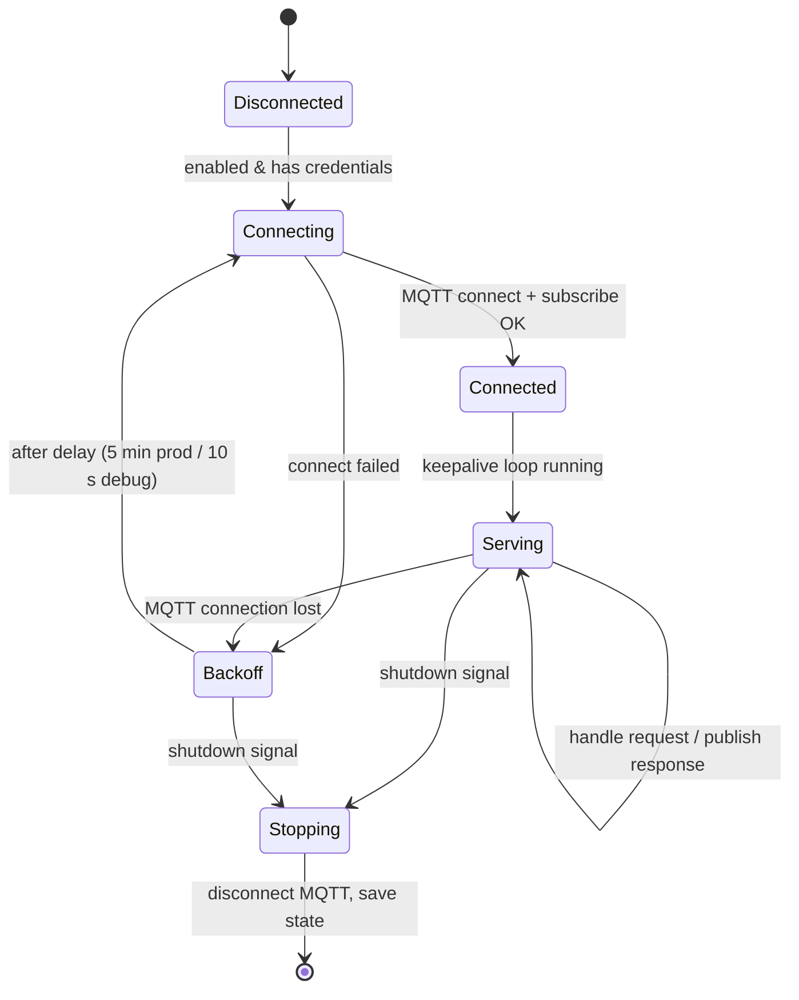

# 01 - Architecture

This document describes the target Go architecture for `gbbconnect-go`. It is the
design the tickets implement. Where it references behaviour, the authoritative
source is the official .NET code in the parent repository.

## 1. High-level overview

`gbbconnect-go` is a long-running bridge process. For each configured **plant**
it maintains an MQTT/TLS connection to the GbbOptimizer cloud, receives Modbus
request batches, executes them against the plant's inverter over a pluggable
**transport** (driver), and publishes responses back to the cloud.



### Key difference from the original

The original creates a **fresh driver and TCP connection per MQTT message** and
serializes *all* transactions across *all* plants with a single static
`SemaphoreSlim` (see
[`SolarmanV5Driver.InternalSend`](../../GbbEngine2/Drivers/000_SolarmanV5/SolarmanV5Driver.cs)
and
[`JobManager-mqtt.cs`](../../GbbEngine2/Server/JobManager-mqtt.cs)). That is
simple but: (a) reconnects the inverter socket on every request, and (b) lets one
slow plant block others.

In `gbbconnect-go` each plant owns a **transaction executor** that serializes
transactions *per plant* (not globally), and the inverter connection can be
reused across requests (with reconnect-on-error). This preserves the
externally-observable timing/retry contract while removing the global bottleneck.
Per-plant serialization is still required because a single inverter/dongle cannot
handle overlapping Modbus transactions.

> Compatibility note: the per-transaction timing constraints (100 ms between
> reads, 3000 ms between writes) and the retry/reconnect counts MUST be preserved
> exactly. See [05-protocol-modbus.md](05-protocol-modbus.md) and
> [06-driver-interface.md](06-driver-interface.md).

## 2. Package / module layout

Proposed Go layout (tickets may refine names; keep `internal/` for non-public
packages):

```
gbbconnect-go/
  go.mod
  cmd/
    gbbconnect/            # main entrypoint (run + discover subcommands)
  internal/
    config/               # YAML model, loader, env overrides, validation
    config/xmlimport/     # legacy Parameters.xml import
    state/                # per-plant runtime state persistence
    cloud/                # MQTT client, keepalive, reconnect loop
    protocol/             # JSON Header/Line types, (de)serialization
    modbus/               # RTU frame build/parse, CRC-16, hex codec
    driver/               # Driver interface + transaction executor + timing
    driver/solarmanv5/    # SolarmanV5 transport + frame
    driver/modbustcp/     # Modbus TCP transport
    driver/modbusrtutcp/  # raw RTU over TCP transport
    driver/modbusserial/  # RTU over serial transport
    discovery/            # UDP discovery + subnet scan
    supervisor/           # process lifecycle, plant workers, signals
    logbuf/               # in-memory + file logging used by log streaming
  docs/                   # this documentation
  deploy/                 # Dockerfile, HA add-on, systemd unit, etc. (later)
```

Dependency direction: `cmd` -> `supervisor` -> (`cloud`, `driver`, `config`,
`state`, `discovery`). Low-level packages (`modbus`, `protocol`, `logbuf`) have
no dependencies on higher layers. `driver/*` depend only on `driver`, `modbus`,
`config`, `logbuf`.

## 3. Concurrency model

- **One goroutine per plant worker.** It owns the MQTT client lifecycle and the
  transaction executor for that plant.
- **MQTT message handling**: the MQTT client library delivers messages on its
  own goroutine(s). Each message is handed to the plant's transaction executor.
  Handling a batch may take seconds (timing constraints + retries), so messages
  must be processed through a bounded queue / single worker per plant to avoid
  unbounded concurrency against one inverter.
- **Transaction executor**: a single goroutine (or a `sync.Mutex`-guarded
  section) that owns the driver connection. All Modbus transactions for the plant
  pass through it, guaranteeing serialization and correct inter-command delays.
- **Keepalive**: a `time.Ticker` (60 s) per connected plant publishes the
  keepalive message. Implementations may run keepalive in the plant worker loop
  rather than a separate goroutine (mirrors original's single loop).
- **Supervisor**: starts/stops plant workers, watches for fatal errors, applies
  global reconnect backoff.
- **Cancellation**: a root `context.Context` is cancelled on shutdown signal;
  every blocking network call respects it (with appropriate timeouts).



## 4. Lifecycle / state machine

Per plant:



Process startup (mirrors
[`JobManager.OurStartJobs`](../../GbbEngine2/Server/JobManager.cs) and
[`Program.Main`](../../GbbConnect2Console/Program.cs)):

1. Resolve config path; load YAML (or import legacy XML). Fail fast with a clear
   message if missing/invalid.
2. Load per-plant state (log streaming positions).
3. Start the supervisor; start a worker per enabled plant.
4. Block until a termination signal (SIGINT/SIGTERM, or Windows service stop).
5. On shutdown: cancel context, disconnect MQTT clients gracefully, persist
   state, exit 0.

The original supports a `--dont-wait-for-key` console flag; the Go version runs
as a foreground daemon by default (no key wait), which is the correct behaviour
for Docker/systemd/HA. See [09-deployment.md](09-deployment.md).

## 5. Error handling & resilience

- **MQTT connection failure**: log, wait (5 min in production, 10 s in debug/dev
  per the original), retry. Matches
  [`OurMqttService`](../../GbbEngine2/Server/JobManager-mqtt.cs).
- **Inverter transaction failure**: retry within the driver (reconnect + retry,
  same counts as original), then surface as a per-line error to the cloud.
- **Error cascading** (compat-critical): on the first failing line, set that
  line's `Error`, null out the `Modbus` field of that and all subsequent lines,
  and stop processing the batch. On a setup/global error (e.g. cannot create
  driver), set the header-level `Error` and null all lines' `Modbus`. See
  [03-protocol-json-app.md](03-protocol-json-app.md).
- **Panics**: each plant worker recovers from panics, logs them, and transitions
  to Backoff rather than crashing the whole process.

## 6. Configuration & state

- Config is loaded once at startup into an immutable in-memory model (see
  [07-configuration.md](07-configuration.md)). Remote `LogLevel` changes update a
  runtime logging level (and may be persisted), but do not require a full config
  reload.
- Per-plant state (log streaming `lastLog_Date` / `lastLog_Pos`) is persisted to
  a small JSON/state file, replacing the original
  `PlantStates/{Number}.json`.

## 7. Observability

- Structured logging (levels: error/warn/info/debug) to stdout (for
  Docker/systemd/HA log capture) and optionally to daily files for the cloud log
  streaming feature.
- The three original verbosity switches map to a single ordered level plus driver
  trace flags (`IsVerboseLog`, `IsDriverLog`, `IsDriverLog2`); see
  [03-protocol-json-app.md](03-protocol-json-app.md) for the `LogLevel` mapping.

## 8. Security

- TLS is mandatory for the cloud MQTT connection (port 8883). Certificate
  verification should be **on** by default (the original disables chain checks
  only in DEBUG builds).
- Secrets (`plant_token`) come from config/env; never log them. See
  [07-configuration.md](07-configuration.md) for secret handling and HA options.
