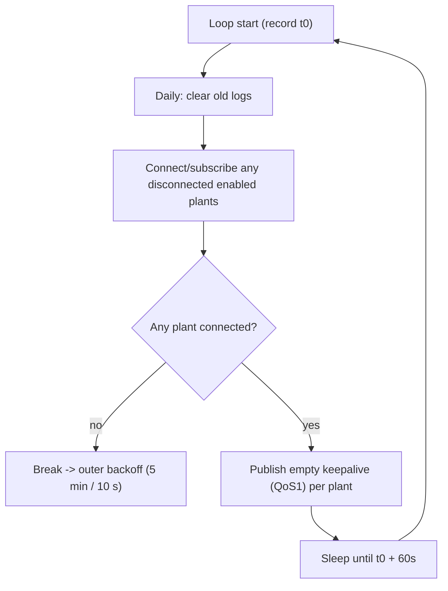

# 02 - Cloud Protocol: MQTT over TLS

This is the transport between `gbbconnect-go` and the GbbOptimizer cloud. It MUST
match the official client exactly so existing plants keep working.

Authoritative source:
[`GbbEngine2/Server/JobManager-mqtt.cs`](../../GbbEngine2/Server/JobManager-mqtt.cs)
(methods `ConnectToMqtt`, `OurMqttService_DoWork`).

## 1. Broker & TLS

- **Client library**: `github.com/eclipse/paho.mqtt.golang` (MQTT 3.1.1).
  This preserves the protocol used by GbbConnect2, supports QoS 1/2, and
  is run with automatic reconnect disabled so the application-owned loop
  preserves the original 5 min / 10 s retry timing.
- **Host**: per-plant, from config `GbbOptimizer_Mqtt_Address`. Default
  `gbboptimizerX-mqtt.gbbsoft.pl` (the literal `X` is part of the default string
  in the original config default; in practice the cloud provides the real
  hostname during plant setup, so treat it as a required configured value).
- **Port**: per-plant `GbbOptimizer_Mqtt_Port`, default `8883`.
- **TLS**: required. In the original, production builds set `UseTls = true`; DEBUG
  builds set `IgnoreCertificateChainErrors = true`. For `gbbconnect-go`:
  - Default: TLS on, full certificate verification.
  - Optional config flag `mqtt.tls_insecure_skip_verify` (default `false`) for
    troubleshooting only; it must be opt-in and loudly logged.

## 2. Authentication

| MQTT field | Value | Source |
|------------|-------|--------|
| Client ID | `GbbConnect2_{PlantId}` | `WithClientId($"GbbConnect2_{plant.GbbOptimizer_PlantId}")` |
| Username | `{PlantId}` | `WithCredentials(PlantId, PlantToken)` |
| Password | `{PlantToken}` | same |

`PlantId` is a UUID string; `PlantToken` is an opaque secret string.

> Compatibility note: keep the Client ID prefix exactly `GbbConnect2_`. The
> broker may use it for identification/ACLs.

Clean session: the original leaves `WithCleanSession` commented out (i.e. uses
the library default). Match the library default; do not force a session expiry
(the original explicitly removed `WithSessionExpiryInterval`).

## 3. Topics

All topics are namespaced by the plant's `PlantId`.

| Topic | Direction | QoS | Purpose |
|-------|-----------|-----|---------|
| `{PlantId}/ModbusInMqtt/toDevice` | Cloud -> device | AtLeastOnce (1) on subscribe | Incoming Modbus request batches |
| `{PlantId}/ModbusInMqtt/fromDevice` | Device -> cloud | ExactlyOnce (2) on publish | Responses |
| `{PlantId}/keepalive` | Device -> cloud | AtLeastOnce (1) | Heartbeat |

- On connect, **subscribe** to `{PlantId}/ModbusInMqtt/toDevice` with QoS 1
  (`WithAtLeastOnceQoS`).
- **Responses** are published to `{PlantId}/ModbusInMqtt/fromDevice` with QoS 2
  (`ExactlyOnce`). This is compat-critical: the cloud expects exactly-once
  delivery of responses.
- **Keepalive** is published to `{PlantId}/keepalive` with QoS 1 and an **empty
  payload**.

## 4. Keepalive & main loop timing

From `OurMqttService_DoWork`:

1. Loop iteration starts; record `LoopStartTime`.
2. Once per calendar day, clear old logs (see
   [07-configuration.md](07-configuration.md)).
3. For each enabled plant with credentials: if not connected, create client,
   register message callback, connect (TLS), subscribe.
4. If no plants are connected at all, break out of the inner loop (which triggers
   the outer retry/backoff). Behaviour to preserve: a fully-unconfigured/failed
   process keeps retrying rather than exiting.
5. For each connected plant: publish empty keepalive (QoS 1).
6. Sleep for the remainder of the **60-second** window:
   `delay = LoopStartTime + 60s - now` (skip if negative).

Outer loop / backoff (`OurMqttService`): on any exception, log and wait before
retrying:

- Production: **5 minutes**.
- Debug/dev: **10 seconds**.

`gbbconnect-go` should expose this via a config/runtime flag (e.g. a `--dev`
mode or `runtime.debug: true`) rather than a compile-time `#if DEBUG`.

## 5. Reconnection

- The original checks `MqttClient == null || !IsConnected` each loop and
  reconnects as needed; it relies on its own 60 s loop rather than the library's
  auto-reconnect.
- `gbbconnect-go` uses an application-owned reconnect loop, matching the
  original. It re-subscribes to `toDevice` after every successful explicit
  connect, keeps publishing keepalive every 60 s, and applies the 5 min / 10 s
  backoff after a failed connection cycle.

## 6. Message receive handling (summary)

When a message arrives on `{PlantId}/ModbusInMqtt/toDevice`, the payload is a
UTF-8 JSON string (see [03-protocol-json-app.md](03-protocol-json-app.md)). The
handler deserializes it, executes the Modbus lines via the plant's driver, builds
the response Header, optionally attaches incremental logs, and publishes to
`fromDevice` (QoS 2). Full semantics are in the JSON protocol doc.

## 7. Compatibility checklist

- [x] Client ID `GbbConnect2_{PlantId}`.
- [x] Username = PlantId, Password = PlantToken.
- [x] TLS on by default with verification.
- [x] Subscribe `{PlantId}/ModbusInMqtt/toDevice` QoS 1.
- [x] Publish responses `{PlantId}/ModbusInMqtt/fromDevice` QoS 2.
- [x] Publish keepalive `{PlantId}/keepalive` QoS 1, empty payload, every 60 s.
- [x] 5 min (prod) / 10 s (dev) outer backoff.
- [x] Never log `PlantToken`.
