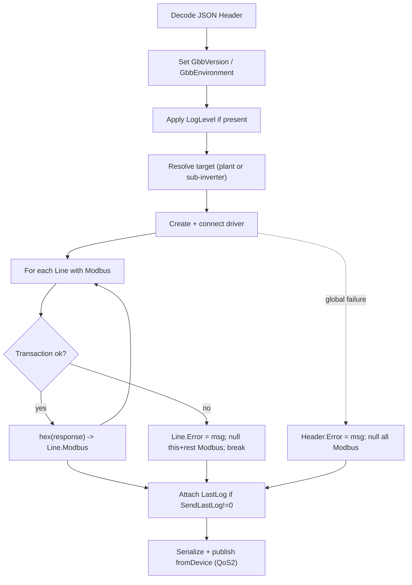

# 03 - Application Protocol: JSON Header/Line

The MQTT payload exchanged on `ModbusInMqtt/toDevice` and
`ModbusInMqtt/fromDevice` is a JSON-encoded `Header` object.

Authoritative sources:
[`GbbConnect2Protocol/Protocol.cs`](../../GbbConnect2Protocol/Protocol.cs)
(the wire types) and
[`GbbEngine2/Server/JobManager-mqtt.cs`](../../GbbEngine2/Server/JobManager-mqtt.cs)
(`MqttClient_MessageReceivedAsync`, the processing logic).

## 1. Wire types

### Header

| JSON field | Type | Direction | Notes |
|------------|------|-----------|-------|
| `Error` | string \| null | response | `null` = no global error |
| `OrderId` | string \| null | both | Echo-back tracking id (<= 256 chars) |
| `LogLevel` | string \| null | request | `OnlyErrors` / `Min` / `Max` (case-insensitive) |
| `SendLastLog` | int \| null | request | non-zero -> include incremental log |
| `SubInverterSN` | string \| null | request | route to a sub-inverter by serial |
| `Lines` | Line[] \| null | both | the Modbus command/response batch |
| `GbbVersion` | string \| null | response | our version string |
| `GbbEnvironment` | string \| null | response | runtime environment label |
| `LastLog` | string \| null | response | incremental log text |

### Line

| JSON field | Type | Direction | Notes |
|------------|------|-----------|-------|
| `LineNo` | int | both | 1,2,3,... |
| `Tag` | string \| null | both | echo-back tag (<= 256 chars) |
| `Timestamp` | long \| null | request | unix seconds UTC |
| `Modbus` | string \| null | both | hex string Modbus RTU frame (with CRC) |
| `Error` | string \| null | response | per-line error or null |

### JSON serialization rules (compat-critical)

- The original uses System.Text.Json with
  `DefaultIgnoreCondition = WhenWritingNull` -> **null fields are omitted** from
  serialized output. Match this: omit null/empty optional fields when encoding.
- Deserialization allows trailing commas (`AllowTrailingCommas = true`). Be
  lenient on input.
- Field names use **PascalCase** exactly as above (`LineNo`, `Modbus`, etc.). In
  Go, set explicit JSON tags; do not rely on Go's default lowercasing.
- `Modbus` hex strings are **uppercase, no separators** (e.g.
  `0103009C0003C5E5`). See [05-protocol-modbus.md](05-protocol-modbus.md) and
  the hex codec in
  [`GbbLibSmall/Convert.cs`](../../GbbLibSmall/Convert.cs). On decode, accept any
  case; on encode, emit uppercase.

## 2. Request example (cloud -> device)

```json
{
  "OrderId": "read-batch-001",
  "Lines": [
    { "LineNo": 1, "Modbus": "0103009C0003C5E5" },
    { "LineNo": 2, "Modbus": "0103009F0001B424" }
  ]
}
```

## 3. Response example (device -> cloud)

```json
{
  "OrderId": "read-batch-001",
  "Lines": [
    { "LineNo": 1, "Modbus": "0103060012003400565886" },
    { "LineNo": 2, "Modbus": "01030200FFxxxx" }
  ],
  "GbbVersion": "1.3.0-go",
  "GbbEnvironment": "Linux"
}
```

## 4. Processing algorithm (must replicate)

From `MqttClient_MessageReceivedAsync`:

1. Decode the payload string to a `Header`. If it is null/empty, do nothing.
2. Set `Header.GbbVersion` and `Header.GbbEnvironment` on the response (see
   §6, §7).
3. **LogLevel**: if `Header.LogLevel != null`, update verbosity (see §5) and
   persist. Unknown values are logged as a warning and ignored.
4. **Resolve target**: default to the plant's `AddressIP` / `PortNo` /
   `SerialNumber`. If `Header.SubInverterSN` is set and non-empty, find a
   matching sub-inverter by `SerialNumber`; use its `AddressIP`, `PortNo`, and
   `DongleSerialNumber`. If not found, raise a global error:
   `"Inverter SerialNumber not found: {SubInverterSN} on Slave Inverters list!"`.
5. **Create driver** for `Plant.DriverNo` (see
   [06-driver-interface.md](06-driver-interface.md)) and connect.
6. **For each line** (in order):
   - if `line.Modbus != null`: decode hex -> bytes, call
     `driver.SendDataToDevice(bytes)`, encode response bytes -> hex, store back
     into `line.Modbus` (overwriting the request).
   - on exception: set `line.Error = ex.Message`, then **null the `Modbus` field
     of this line and every subsequent line**, and **break**. (Error cascading.)
7. If a **global** exception happened (driver creation, target resolution):
   set `Header.Error = ex.Message` and null **all** lines' `Modbus`.
8. Always dispose/close the driver afterwards.
9. **SendLastLog**: if `Header.SendLastLog != 0` and not null, attach incremental
   log text (see §8).
10. Serialize `Header` -> JSON, publish to `{PlantId}/ModbusInMqtt/fromDevice`
    (QoS 2). Persist updated log position state.



## 5. LogLevel mapping

`Header.LogLevel` is matched case-insensitively to one of the constants in
`Protocol.cs` and maps to three boolean switches:

| LogLevel | IsVerboseLog | IsDriverLog | IsDriverLog2 |
|----------|:------------:|:-----------:|:------------:|
| `OnlyErrors` | false | false | false |
| `Min` | true | false | false |
| `Max` | true | true | true |

In Go these map to: `IsVerboseLog` -> info-level app logging on/off;
`IsDriverLog` -> driver decoded-Modbus tracing; `IsDriverLog2` -> raw frame
hex tracing. The change is persisted to config so it survives restart (original
calls `Parameters.Save()`).

## 6. GbbVersion

The original sets `Header.GbbVersion = Parameters.APP_VERSION` (currently
`"1.3.0"` in
[`Parameters.cs`](../../GbbEngine2/Configuration/Parameters.cs); note the
reverse-engineered doc says `1.2.3`). `gbbconnect-go` should send its own version
string. Suggested format: `"<semver>-go"` (e.g. `1.3.0-go`). This field is
informational for the cloud.

## 7. GbbEnvironment

The original sets `"Windows"`, `"Console"`, or `"Library"` depending on the host
app. `gbbconnect-go` should set a clear, configurable label. Default suggestion:
the OS name (`"Linux"`, `"Windows"`, `"Darwin"`) or a fixed
`"gbbconnect-go"`. This field is informational; the cloud "will cope" with any
value.

## 8. Log streaming (SendLastLog / LastLog)

Optional feature; the cloud requests incremental logs by setting `SendLastLog`
non-zero. The original (`MqttClient_MessageReceivedAsync`, the "Add Last log"
block) keeps per-plant `LastLog_Date` and `LastLog_Pos`:

- It reads from today's daily log file starting at the stored byte position,
  appends the new text to `Header.LastLog`, and advances the position.
- Day rollover is handled: if the stored date is yesterday, it sends the rest of
  yesterday then resets to today at position 0; if the date is older/unset, it
  jumps to the end of today's file.

`gbbconnect-go` should implement an equivalent using the file-based log buffer
(see [01-architecture.md](01-architecture.md) §7 and the `logbuf` package). It is
acceptable to ship an initial version that returns `null` LastLog (the cloud
copes) and implement full streaming in a later ticket, but the state fields must
exist from the start (see [07-configuration.md](07-configuration.md) state
section).

## 9. Compatibility checklist

- [x] PascalCase JSON field names; null fields omitted on encode.
- [x] Lenient decode (trailing commas, case-insensitive LogLevel/hex).
- [x] Per-line execution overwrites `Modbus` with the response hex.
- [x] Error cascading: first failure nulls this + remaining lines and breaks.
- [x] Global failure nulls all lines and sets `Header.Error`.
- [ ] Sub-inverter routing by `SubInverterSN` with the exact not-found message.
- [x] `GbbVersion` / `GbbEnvironment` set on every response.
- [x] Response published QoS 2.
