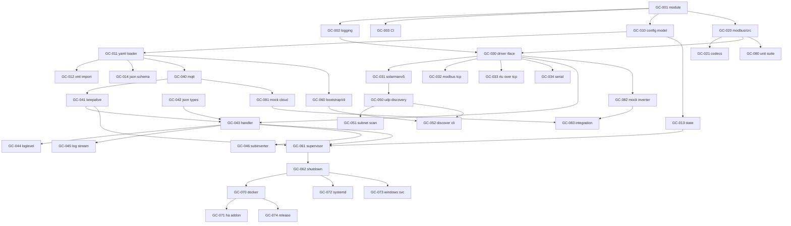

# Implementation Backlog (Jira-style tickets)

This backlog turns the design docs in [`../`](../) into actionable, self-contained
tickets for implementing `gbbconnect-go`. Each ticket links to the relevant
official .NET source and design doc, states acceptance criteria, and includes
test notes so an implementer (human or AI agent) can pick it up independently.

## How to use this backlog

- Work in dependency order (see the graph below). Within an epic, lower numbers
  usually come first.
- Each ticket file is named `GC-XXX-short-slug.md`.
- "Definition of Done" for every ticket: code compiles, `go vet` + linter clean,
  unit tests for the new behaviour pass, and the relevant acceptance-matrix items
  in [10-compatibility-and-testing.md](../10-compatibility-and-testing.md) are
  satisfied.
- Do not break wire compatibility; when in doubt, the C# source is authoritative.

## Epics

| Epic | Theme |
|------|-------|
| A | Project scaffolding & tooling |
| B | Configuration & domain model |
| C | Modbus core (framing, CRC, codec) |
| D | Transports / drivers |
| E | Cloud gateway (MQTT + JSON protocol) |
| F | Discovery |
| G | Runtime & orchestration |
| H | Packaging & deployment |
| I | Testing & QA |
| J | Documentation & onboarding |

## Tickets

### EPIC-A - Scaffolding & tooling
- [GC-001](GC-001-go-module-and-layout.md) - Go module & package layout
- [GC-002](GC-002-logging.md) - Structured logging & log buffer
- [GC-003](GC-003-lint-and-ci.md) - Lint, format, unit-test CI
- [GC-004](GC-004-cross-compile-matrix.md) - Cross-compile build matrix

### EPIC-B - Configuration & domain
- [GC-010](GC-010-config-model.md) - Config domain model
- [GC-011](GC-011-yaml-loader.md) - YAML loader, env overrides, validation
- [GC-012](GC-012-legacy-xml-import.md) - Legacy Parameters.xml import
- [GC-013](GC-013-state-persistence.md) - Per-plant state persistence
- [GC-014](GC-014-json-schema.md) - JSON Schema for config / HA options

### EPIC-C - Modbus core
- [GC-020](GC-020-modbus-rtu-crc.md) - Modbus RTU framing, CRC-16, hex codec
- [GC-021](GC-021-modbus-codecs.md) - Read/Write register codecs & interpretation

### EPIC-D - Transports
- [GC-030](GC-030-driver-interface-executor.md) - Driver interface & transaction executor
- [GC-031](GC-031-solarmanv5.md) - SolarmanV5 transport
- [GC-032](GC-032-modbus-tcp.md) - Modbus TCP transport
- [GC-033](GC-033-modbus-rtu-tcp.md) - Modbus RTU-over-TCP transport (new)
- [GC-034](GC-034-modbus-serial.md) - Modbus serial transport (new)

### EPIC-E - Cloud gateway
- [GC-040](GC-040-mqtt-client.md) - MQTT/TLS client
- [GC-041](GC-041-keepalive-reconnect.md) - Keepalive & reconnect loop
- [GC-042](GC-042-json-protocol.md) - JSON Header/Line types
- [GC-043](GC-043-message-handler.md) - Message handler & error cascading
- [GC-044](GC-044-loglevel-control.md) - Remote LogLevel control
- [GC-045](GC-045-log-streaming.md) - Incremental log streaming
- [GC-046](GC-046-subinverter-routing.md) - Sub-inverter routing

### EPIC-F - Discovery
- [GC-050](GC-050-udp-discovery.md) - UDP Solarman discovery
- [GC-051](GC-051-subnet-scan.md) - Subnet scan discovery
- [GC-052](GC-052-discover-cli.md) - `discover` CLI subcommand

### EPIC-G - Runtime
- [GC-060](GC-060-app-bootstrap-cli.md) - App bootstrap & CLI
- [GC-061](GC-061-supervisor-lifecycle.md) - Supervisor & plant workers
- [GC-062](GC-062-graceful-shutdown.md) - Signals & graceful shutdown

### EPIC-H - Packaging
- [GC-070](GC-070-dockerfile.md) - Multi-arch Dockerfile
- [GC-071](GC-071-ha-addon.md) - Home Assistant Add-on
- [GC-072](GC-072-systemd.md) - systemd unit
- [GC-073](GC-073-windows-service.md) - Windows Service support
- [GC-074](GC-074-release-pipeline.md) - Release pipeline

### EPIC-I - Testing & QA
- [GC-080](GC-080-unit-suite.md) - Unit test suite & golden vectors
- [GC-081](GC-081-mock-cloud.md) - Mock MQTT cloud harness
- [GC-082](GC-082-mock-inverter.md) - Mock inverter harness
- [GC-083](GC-083-integration-tests.md) - End-to-end integration & compat tests

### EPIC-J - Docs
- [GC-090](GC-090-user-docs.md) - User documentation
- [GC-091](GC-091-developer-onboarding.md) - Developer onboarding

## Suggested order / dependency graph

## Status legend

Each ticket has a `Status:` field. Initially all are `TODO`. Implementers update
it to `IN PROGRESS` / `DONE` (or track in your issue tracker if importing).

| Ticket | Epic | Priority | Status |
|--------|------|----------|--------|
| GC-001 | A | High | DONE |
| GC-002 | A | High | DONE |
| GC-003 | A | Medium | DONE |
| GC-004 | A | Medium | DONE |
| GC-010 | B | High | DONE |
| GC-011 | B | High | DONE |
| GC-012 | B | Medium | DONE |
| GC-013 | B | High | DONE |
| GC-014 | B | Medium | DONE |
| GC-020 | C | High | DONE |
| GC-021 | C | High | DONE |
| GC-030 | D | High | DONE |
| GC-031 | D | High | DONE |
| GC-032 | D | High | DONE |
| GC-033 | D | Medium | DONE |
| GC-034 | D | Medium | DONE |
| GC-040 | E | High | DONE |
| GC-041 | E | High | DONE |
| GC-042 | E | High | TODO |
| GC-043 | E | High | TODO |
| GC-044 | E | Medium | TODO |
| GC-045 | E | Low | TODO |
| GC-046 | E | Medium | TODO |
| GC-050 | F | Medium | TODO |
| GC-051 | F | Low | TODO |
| GC-052 | F | Medium | TODO |
| GC-060 | G | High | TODO |
| GC-061 | G | High | TODO |
| GC-062 | G | High | TODO |
| GC-070 | H | High | TODO |
| GC-071 | H | High | TODO |
| GC-072 | H | Medium | TODO |
| GC-073 | H | Low | TODO |
| GC-074 | H | Medium | TODO |
| GC-080 | I | High | TODO |
| GC-081 | I | Medium | TODO |
| GC-082 | I | Medium | TODO |
| GC-083 | I | Medium | TODO |
| GC-090 | J | Low | TODO |
| GC-091 | J | Low | TODO |

## MVP cut

A minimal working bridge (single plant, SolarmanV5, no extras) needs:
GC-001, GC-002, GC-010, GC-011, GC-013, GC-020, GC-021, GC-030, GC-031, GC-040,
GC-041, GC-042, GC-043, GC-060, GC-061, GC-062, plus GC-080 for confidence.
